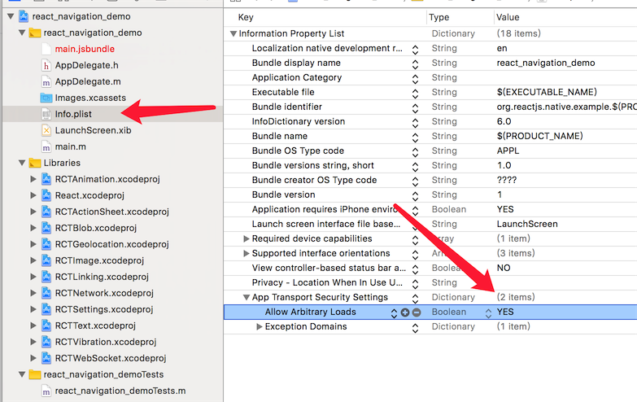
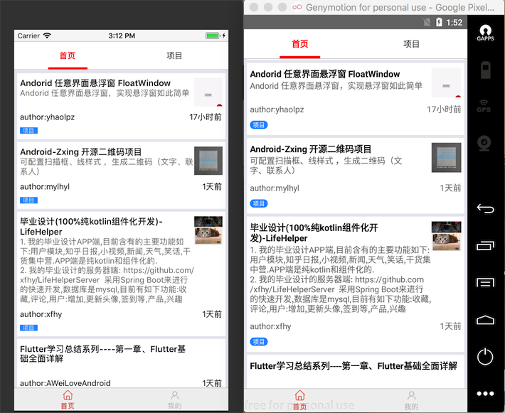
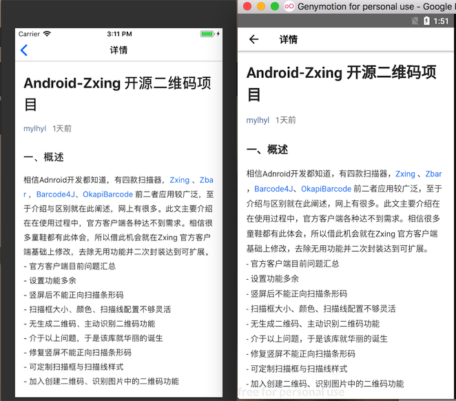

#入门级项目，可以看一下 《大前端进化史》 及 《RN 环境配置及入门demo》 了解详细机制

# rn-demo
fetch、FlatList、wanandroid、webview、react-navigation、react-native-scrollable-tab-view

# ios问题

由于ios不能加载http链接，需要在info.plist添加***App Transport Security Settings***，并设置***Allow Arbitrary Loads***为true

# screen pic

